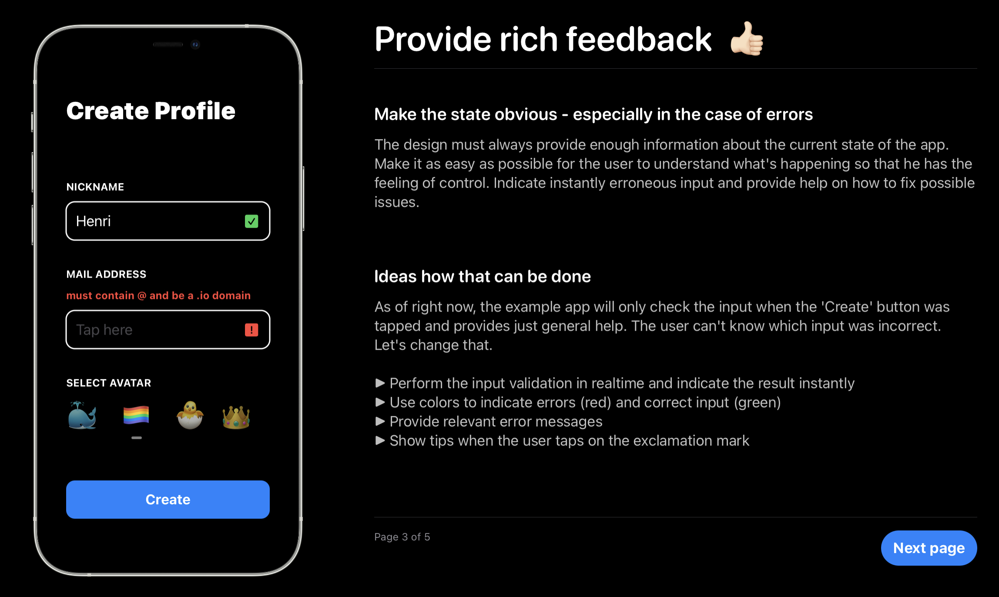

# User Experience Playground - Swift Student Challenge Winner 2021 🎉
An educational Swift Playground dealing with Usability and User Experience Design. Created as a submission to the 2021 Apple Swift Student Challenge by Henri Bredt in April 2021.

## About ✌🏻
The Playground focuses on three important aspects of designing a good user experience. It provides an interactive simulated app on the left side and explanations and navigation options on the right side. The simulated app has very poor usability at first and gets improved step by step with some key lessons to take away. Because the user can interact with the simulated app in its different versions he can get a great understanding of how bad usability feels and how the changes improve the app. 

When the user has finished exploring the Playground, he is sensitized for bad UX, knows some fundamental rules and experienced the apps transformation from bad to good usability.

## Installation 👨🏼‍💻
The Playground was optimized for running on iPad. Download the Swift Playgrounds App from the App Store and open this playground. Make sure to turn off 'Enable Results'.
